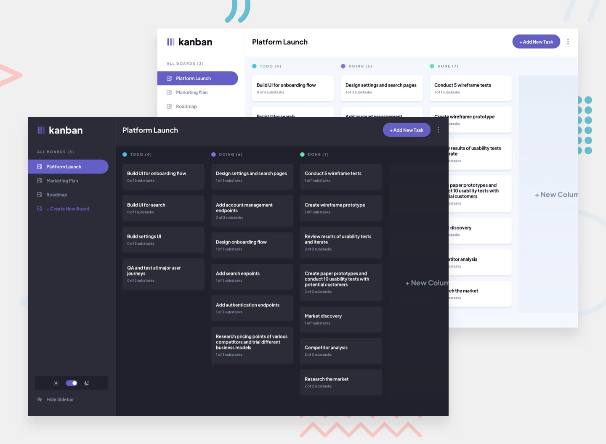

# Kanban Task Management Web App



- [Github](https://github.com/barriedirk/frontend-mentor-exercise-41-kanban-task-management-web-app)
- [Live Demo](https://kanban-task-management-web-app-frontend.vercel.app/)
- [Repository Frontend Mentor](https://www.frontendmentor.io/profile/barriedirk?tab=solutions)

## Project Overview

This project is a full-stack Kanban task management application developed to meet professional standards. The solution provides a scalable and responsive interactive digital board where users can create, read, update, and delete boards, columns, and tasks. It delivers a modern user experience complete with seamless drag-and-drop functionality, ensuring that all interactions natively persist to the backend.

## Project Structure

The project adopts a modern decoupled repository architecture split into two independent workspaces:

- `/frontend`: The client-facing Next.js browser application.
- `/backend`: The Strapi headless CMS providing REST API persistence.

## Tech Stack

- **Frontend Environment:**
  - Next.js
  - Tailwind CSS
  - Zustand (State Management)
  - @hello-pangea/dnd (Drag and Drop Interactions)
- **Backend Environment:**
  - Strapi Cloud (Headless CMS)
  - SQLite (Local configuration)

## Architecture

This application employs a Headless CMS approach leveraging a fully decoupled frontend and backend.
A decoupled design establishes clear boundaries between the presentation components and the backend data model logic. Next.js functions as the independent presentation layer, securely consuming stateless REST API endpoints exposed by the Strapi CMS. This pattern significantly simplifies scaling efforts, deployment workflows, and long-term project maintainability.

## Technical Highlights

### Drag & Drop Persistence

Task reordering leverages robust Fractional Indexing (LexoRank behavior) to maintain precise position metadata within the database. This strategic algorithmic choice avoids computationally expensive cascading updates or integer recalculations for an entire array when dragging and dropping a task. By calculating an index fractionally aligned exactly between adjacent items, the system guarantees efficient database updates in O(1) time complexity.

### Security & Infrastructure

API Infrastructure incorporates dynamic Cross-Origin Resource Sharing (CORS) configurations directly mapped to deployment parameters. The `config/middlewares.ts` rules securely adapt whitelisted origins based on defined frontend origin environmental variables, bridging the gap safely between local testing and production deployments. The backend is configured to be optimally served directly from a Strapi Cloud instance.

### Optimistic Updates

To eliminate perceptual latency during structural interactions like moving tasks between active columns, the architecture invokes Optimistic UI updates. Complex interface updates immediately modify the frontend Zustand store states locally resulting in a synchronous feel mechanism. Slower server verifications and API write functions occur asynchronously in the background layer, drastically improving the end-user interaction quality while retaining transactional integrity.

## Getting Started

### Prerequisites

Ensure you have a recent version of Node.js along with `pnpm` installed on your machine.

### Frontend

First, configure and initialize the presentation layer:

```bash
cd frontend
pnpm install
pnpm dev
```

The frontend should start successfully on your local `localhost` port.

### Backend

The repository's frontend instances currently interface seamlessly into a managed Strapi Cloud environment. No direct backend initialization is strictly necessary to evaluate the core functionality.

## Environment Variables

For the frontend application to synchronize correctly with your own backend deployment or the existing test environment, a valid environmental instance configuration must be provided. Setup a `.env.local` inside `/frontend` utilizing the framework below:

```ini
NEXT_PUBLIC_STRAPI_URL="<your_strapi_remote_or_local_url>"
```

_(Ensure environmental keys remain untracked by source control to prevent unauthorized exposure of credentials.)_
